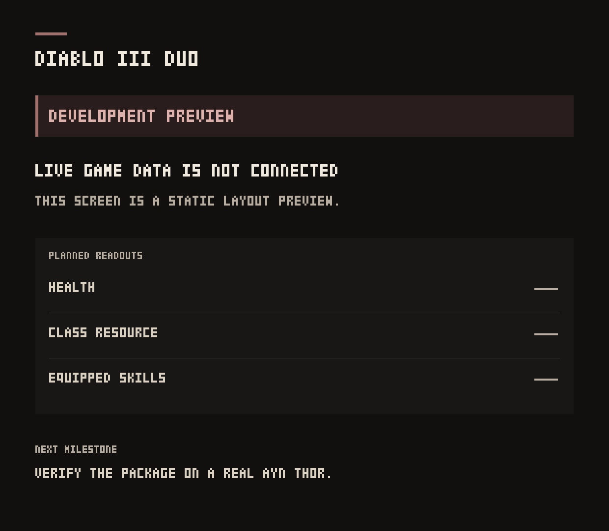

# Diablo III Duo

An early companion project for **Diablo III: Eternal Collection (Switch)** on the AYN Thor, using [Eden Duo](https://github.com/igawa6/eden-duo).

**Current version: 0.1.0-dev — development UI only.**

The package displays a clearly labelled status page on the lower screen. It has no live game values, memory reads, writes, game patches, inventory actions, or game assets. **The static preview was installed and rendered on an AYN Thor on 2026-10-06. No live reader or supported game build has been verified.** This hardware observation establishes package loading and the captured layout only.

## Included

- A 1240 × 1080 status manifest for the lower screen.
- An offline builder using the unmodified, pinned Eden Duo package builder.
- Local metadata tools for an already decrypted ExeFS `main` and bounded, advisory NSP container inspection.
- Tests for packaging, unverified-support guards, metadata parsing, and non-destructive input handling.
- CI, installation and compatibility guides, and a device-validation protocol.

The target title ID is `01001B300B9BE000`. Eden Duo Info confirms it. Update `2.7.7.92380` and its executable build have now been identified; no live reader has been verified. No region mapping or supported update version is claimed.

Start with [START_HERE.txt](START_HERE.txt). See [installation, update and removal](docs/installation.md), [compatibility](docs/compatibility.md), and [current validation](docs/validation.md). There is no working live-data release. Any CI artifact is a static development preview.



Original lower-screen capture, 2026-10-06: the game was at its title screen.
The readouts are placeholders. The screenshot contains only the companion UI;
it is not evidence of live values, gameplay input routing or measured performance.

## Build the development package

Python 3.10 or newer is sufficient. No third-party Python dependencies or game files are needed for this build.

```sh
python3 tools/build.py
```

Output: `dist/01001B300B9BE000.dsmod.zip`.

The ZIP contains exactly `package.json` and `dualscreen/manifest.json`. Rebuilding unchanged input produces identical bytes. `tools/build.py --check` validates the static development manifest without creating an archive.

## Device evidence and installation

The package declares companion runtime 18, which matches the upstream runtime checked on 2026-10-06. The observed device runs Android 13 and Eden Duo 1.1.0. The owner confirmed gameplay with a fresh non-seasonal Barbarian in a separate test profile, and a device capture recorded that session. The static companion was subsequently installed through Add-ons and rendered at the game title screen. Gameplay and input routing with the companion active remain unverified.

For another installation, first confirm that the unmodified game starts and runs satisfactorily. Use a disposable copy of the game's profile/save for development.

After confirming the title ID matches, install the ZIP through the game's **Add-ons → Install → Dual screen mods** menu. Start the game and check whether the lower screen shows **DEVELOPMENT PREVIEW** and **Live game data is not connected**. This verifies package loading and layout only. It does not establish working game-data access.

Record the Eden Duo version, game update version, title ID, whether the page appeared, and any visible layout problems. No root requirement is introduced by this package. Device debugging requires separate authorization.

## Identify an executable build locally

Keep the game files on the computer used for development. Once Eden's documented tooling has produced the updated game's decrypted ExeFS `main`, run:

```sh
python3 tools/inspect_game.py --main /path/to/exefs/main --game-version "VERSION" --output private/intake.json
```

Create the `private` directory first if it does not exist. An optional `--rom /path/to/game.nsp` records only the filename and size. The tool does not decrypt an NSP/XCI, inspect game contents, upload anything, or establish compatibility. It reads 256 bytes from `main`; all source files remain untouched. Output creation refuses to overwrite an existing file.

The title ID in the report is explicitly unverified because an NSO header alone does not establish the game title. The report contains basenames rather than full paths and must never be treated as proof of live memory addresses.

## Inspect an NSP locally

For an NSP that has not been decrypted, use the separate bounded inspector:

```sh
python3 tools/inspect_nsp.py --nsp private/roms/game.nsp --output private/container-intake.json
```

It reads the PFS0 directory and optional CNMT XML, with explicit size and bounds
checks. It does not read ticket, certificate or NCA payloads, decrypt, extract, or
upload files. XML metadata is advisory and unauthenticated. It cannot establish
the running update, display version, executable build ID, or game compatibility.
Reports refuse to overwrite existing files. Keep them under `private/`.

## Tests

```sh
python3 -m unittest discover -s tests -v
```

These are tooling tests with synthetic fixtures. They do not test Diablo III or emulate Thor hardware.

## Next milestone

Show one independently verified live value, such as character level or health, on the lower screen through two fresh game launches and a different copied character/save. Then expand to a useful verified set of health, resource, progression or skill fields. Inventory interaction remains a separate later milestone. See [the continuation guide](docs/next-step.md) and [upstream investigation](docs/upstream-research.md).

The documented live research path uses Linux. Current upstream native modules
cannot load on macOS, and Android NCE does not provide the documented desktop
guest-call bridge. Mac tooling tests do not establish Thor support.

## Contribute and release

Read [CONTRIBUTING.md](CONTRIBUTING.md), [CHANGELOG.md](CHANGELOG.md), and
[the release requirements](docs/releasing.md). CI uses synthetic inputs and
builds only the static package. It does not need private game files.

## Upstream and licence

This project uses the GPL-3.0 Eden Duo companion framework. The unmodified package builder and format documentation are pinned to commit `015d083e8859c86480360f44b65c4104bbf3c839`; file hashes and provenance are in `vendor/UPSTREAM.json`. The full licence is in `LICENSE`.

This project is unofficial and is not affiliated with Blizzard, Nintendo, AYN or the Eden maintainers. Users supply their own game files. Game archives, extracted art, keys, firmware, saves and memory dumps are not included in releases.
