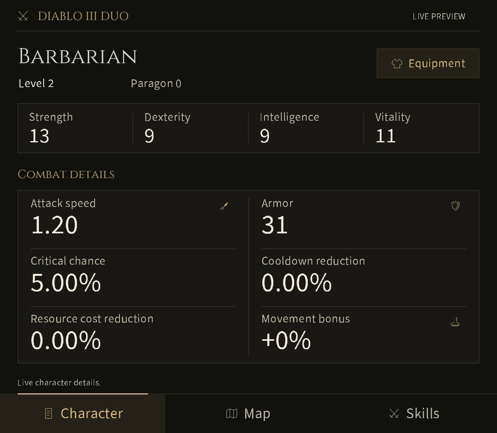
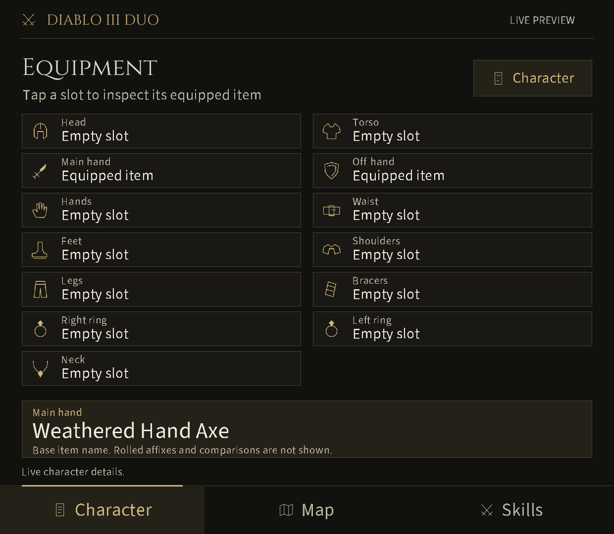
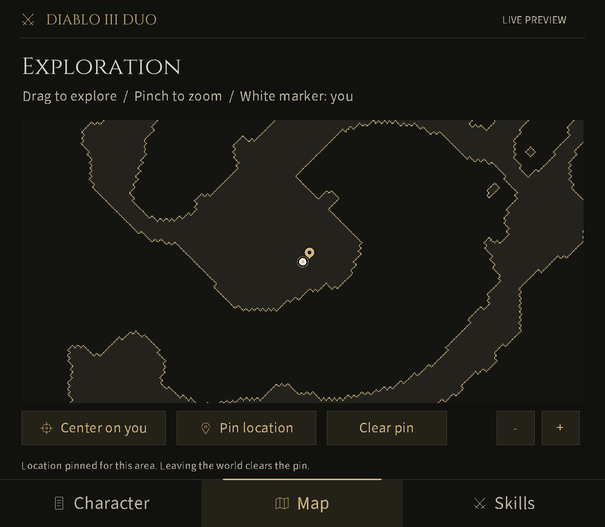
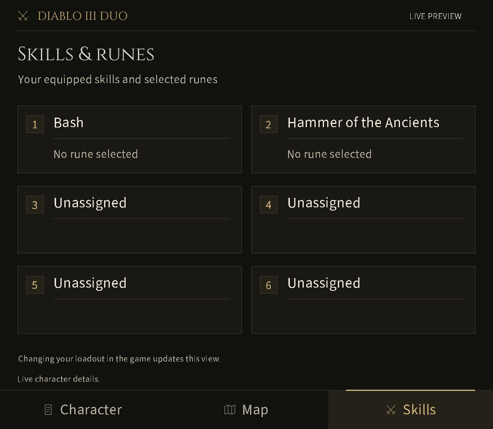

# Diablo III Duo

A read-only lower-screen companion for **Diablo III: Eternal Collection (Switch)**
on the AYN Thor, using [Eden Duo](https://github.com/igawa6/eden-duo).

**0.2.1-dev is an experimental live preview.** It targets one executable build;
it is not a broad compatibility or finished-release claim. The interface uses
warm black, antique gold, serif headings and clear touch controls, without
character artwork.

## Features

- **Character:** class, level, Paragon, Strength, Dexterity, Intelligence,
  Vitality, attack speed, armor, critical chance, cooldown reduction, primary
  resource cost reduction and movement bonus.
- **Equipment:** thirteen body slots, occupied/empty state, and tap-to-inspect
  localized base item names. Equipment changes remain in the game.
- **Skills:** six equipped skill names and no-rune/unavailable-rune states.
- **Map:** live explored coverage, supported terrain grids, your position,
  player following, touch pan/pinch, zoom controls and one local location pin. Changing worlds clears the pin.

Missing or rejected data remains unavailable. Terrain is static ground coverage;
unsupported scenes can be omitted. Doors, enemies, automatic pylon/exit labels,
Greater Rift progress/timing, item rolls/comparison, full affixed item names,
sheet damage/toughness/recovery and critical damage are not implemented.
The reference designs illustrate a broader goal than the current verified reader.

See [current device evidence and limits](docs/next-step.md),
[compatibility](docs/compatibility.md) and [installation](docs/installation.md).
Download [v0.2.1-dev](https://github.com/weeknds/diablo3-duo/releases/tag/v0.2.1-dev).

## On the Thor

Actual companion screenshots from the lower display. The 0.2.1 map capture
precedes the final GPU-compositor setting; its device confirmation is pending:

| Character | Equipment |
| --- | --- |
|  |  |

| Exploration | Skills |
| --- | --- |
|  |  |

## Build and test

Use Python 3.10 or newer. The live preview additionally requires a local
**macOS Android NDK r28c (28.2.13676358)**.

```sh
python3 native/test.py
python3 native/build.py --ndk /path/to/android-ndk-r28c --output dist/native-0.2.0
python3 native/test.py --ndk /path/to/android-ndk-r28c --output dist/verify-0.2.0
```

The installable package and checksum are written under the chosen output
folder. The final command also checks that two Android builds produce identical
archives. No game files, keys, firmware or saves are build/test inputs.
See the [native build guide](native/README.md).

The older, separate **0.1.1-dev static design preview** remains buildable:

```sh
python3 tools/build.py --check
python3 tools/build.py
python3 -m unittest discover -s tests -v
```

Its `project.json` and `dist/01001B300B9BE000.dsmod.zip` describe that static output,
not the native preview. Static sample renders contain clearly labeled example
data and never feed the live package.

## Validation

Synthetic tests cover exact-build gates, bounded failed reads, stale ownership,
reader formulas, map/pin lifetime, image worker behavior and packaging. Device
observations are recorded separately in the [validation record](docs/validation.md).
A compile or screenshot alone does not establish gameplay compatibility.

The previous 0.1.2 candidate was tested on early-level Barbarian and Wizard
characters, with controlled equipment/skill changes, normal quit, relaunch,
suspend/resume, town/inn travel and one death/resurrection. Its short stationary
presentation measurements are historical evidence, not measurements of the new
terrain/equipment readers. Broader classes, nonzero reduction bonuses and sustained
combat remain outside that evidence.

## Contribute and licence

Read [CONTRIBUTING.md](CONTRIBUTING.md), [CHANGELOG.md](CHANGELOG.md) and
[release requirements](docs/releasing.md). The public build and CI require no
private game material. Keep ROMs, saves, dumps, keys and extracted assets outside
source and release archives.

This project uses the GPL-3.0 Eden Duo companion framework. The package builder
and format documentation remain pinned in `vendor/UPSTREAM.json`; native ABI
provenance is in `native/vendor/UPSTREAM.json`. Font licences and original-art
provenance ship with the package.

This project is unofficial and is not affiliated with Blizzard, Nintendo, AYN
or the Eden maintainers. Users supply their own game files.
