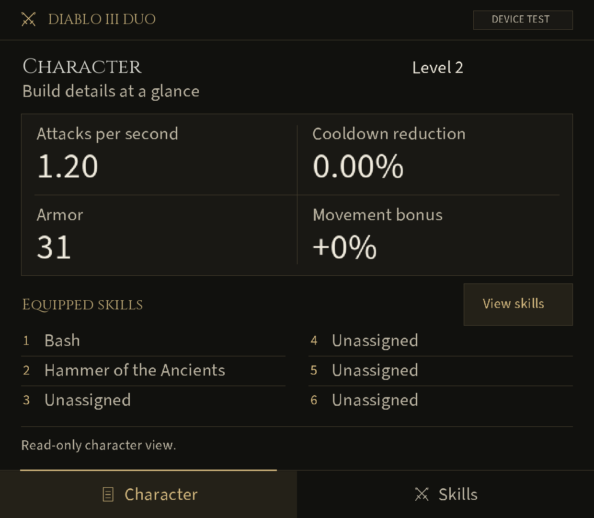

# Diablo III Duo

A read-only lower-screen companion for **Diablo III: Eternal Collection (Switch)** on the AYN Thor, using [Eden Duo](https://github.com/igawa6/eden-duo).

**`0.1.2-rc.1` is a live candidate undergoing device validation. It is not a verified working release.** The separate `0.1.1-dev` static design preview remains available to build. No supported game build has been declared.

Download the candidate package and checksum from [v0.1.2-rc.1](https://github.com/weeknds/diablo3-duo/releases/tag/v0.1.2-rc.1), or build locally with the command below.

The live candidate has two pages: **Character** and **Skills**. It connects character level, attacks per second, cooldown reduction, armor, movement bonus and six equipped skill names to an exact-build, bounded native reader. Missing or rejected data stays unavailable. Rune names, passives, maps, buff timers, item comparison and equipment actions are not included; only the no-rune state can be identified.

The interface uses warm black, antique gold, clear statistics and numbered skill rows. It contains no character imagery or duplicate health/resource HUD. Touch actions select companion pages; the reader does not write game memory.



Actual 1240 × 1080 Thor capture, 2026-10-07. Level 2, attacks per second 1.20, cooldown reduction 0.00% and armor 31 matched the game's menus in this session. Bash, Hammer of the Ancients, their no-rune states and movement +0% also matched the game menus. See the [Skills page](docs/images/live-candidate-skills-thor.png) and [unavailable startup state](docs/images/live-candidate-startup-thor.png). The **DEVICE TEST** badge marks the validation candidate.

## Choose a build

| Build | Command | Output | Status |
| --- | --- | --- | --- |
| Live candidate `0.1.2-rc.1` | `python3 native/build.py --ndk /path/to/android-ndk-r28c` | `dist/live/01001B300B9BE000.dsmod.zip` | Live menu values and short cadence checks observed; broader validation pending |
| Static preview `0.1.1-dev` | `python3 tools/build.py` | `dist/01001B300B9BE000.dsmod.zip` | Character, Combat and Map design pages; all game values unavailable |

Use Python 3.10 or newer. The static package needs no third-party Python dependencies or game files. The live candidate additionally needs Android NDK r28c (`28.2.13676358`); the documented build runs on macOS. Neither build needs a ROM, save, firmware or keys. Keep each package with its own `SHA256SUMS` and check the checksum before installation.

The static builder retains its strict development-only checks. It does not enable live support. The native builder creates a separate candidate archive with the module, UI assets and required licence notices. See [installation and removal](docs/installation.md) and [compatibility](docs/compatibility.md) before testing either package.

## What has been verified

On 2026-10-07, the connected Thor reported Android 13 and Eden Duo 1.1.0 (versionCode 33940730), with game update `2.7.7.92380` enabled. The recovered native reader rebuilt with NDK r28c to the exact previously recorded binary hash. The full public suite passed 76 tests; native verification passed five sanitizer suites and 15 Python tests. Two NDK builds produced identical candidate archives. These checks establish source/build integrity and synthetic behavior, not Android gameplay support.

Earlier private `0.0.8-research` testing matched character level, three equipped skill names, attacks per second and armor against the game's menus on early-level Barbarian and Wizard characters. Weapon and shield changes produced matching stat changes. That prototype repeated Wizard values through two fresh launches, cleared values at startup/quit and recovered after an approximately 90-second suspend. Movement was observed only at +0%; only the no-rune state was checked.

The candidate was installed through Eden Add-ons on 2026-10-07. Package/version and native-module hash matched on device; the module loaded for the exact recorded game build. The actual 1240 × 1080 lower display rendered correctly at the title screen, with unavailable values and a clear startup status. Logs recorded both Character and Skills page actions.

Current-candidate comparisons matched Barbarian level 2, attacks per second 1.20, cooldown reduction 0.00%, armor 31 and movement +0%, plus Bash and Hammer of the Ancients with no runes. Clearing/restoring Hammer changed slot 2 to Unassigned and back correctly. Values returned after a second fresh enabled launch. Removing/restoring the axe changed attacks per second 1.20 → 1.00 → 1.20, matching Character Details in all three states; the axe was restored.

Switching through ordinary hero selection to Wizard matched level 1, attacks per second 1.20, armor 16, cooldown reduction 0.00% and movement +0%. Magic Missile/no-rune and five empty/locked slots matched Skills. Clearing and restoring Magic Missile changed its row to Unassigned and back correctly. Normal quit cleared every value row. Both companion pages and physical +/Y controls worked; lower-screen navigation while Skills was open left the game's selection unchanged. After 108.47 seconds with the screens off, Eden remained paused on wake; using Resume restored the Wizard's values and Magic Missile. Ordinary door travel from New Tristram into The Slaughtered Calf Inn and back preserved the Barbarian's correct values on both companion pages.

Two short stationary windows per condition showed 51.22–52.15 presentation events/second with the companion disabled and 50.59–51.57 enabled, with similar approximately 33.38 ms 95th-percentile intervals. This showed no obvious large cadence regression in those windows; it does not establish zero overhead, unique game FPS or sustained-combat performance. The [validation record](docs/validation.md) gives the method and limits.

These are narrow observations from the current candidate. Nonzero cooldown/movement coverage, death, broader travel/loading and other lifecycle states, full input coverage and sustained gameplay measurements remain pending. The brief loading interval on the tested town/inn route was not captured. Historical observations do not validate those remaining checks. See [the current checkpoint](docs/next-step.md), [compatibility](docs/compatibility.md) and [validation protocol](docs/device-validation.md).

## Test and preview locally

```sh
python3 tools/build.py --check
python3 -m unittest discover -s tests -v
python3 native/test.py
```

Host tests use synthetic fixtures and do not emulate the Thor. With Pillow installed, `python3 tools/render_preview.py` renders the static unavailable states; `--sample` and `--stress` produce labeled offline illustrations without changing the installable package. `python3 tools/design_layout.py` regenerates the static layout and licensed/original UI assets. See [asset provenance](design/ASSETS.md) and the [UI specification](docs/ui-spec.md).

## Local game metadata tools

The optional tools below keep source files untouched and refuse to overwrite an existing report. Create `private/` first and keep game material and reports there.

```sh
python3 tools/inspect_game.py --main /path/to/exefs/main --game-version "VERSION" --output private/intake.json
python3 tools/inspect_nsp.py --nsp private/roms/game.nsp --output private/container-intake.json
```

The first reads an already decrypted NSO header; the second reads bounded PFS0 directory and optional CNMT XML metadata without reading ticket, certificate or NCA payloads. Neither decrypts, extracts, uploads or establishes live compatibility. An NSO build ID alone does not prove the title or running update; optional XML metadata is unauthenticated.

## Contribute and release

Read [CONTRIBUTING.md](CONTRIBUTING.md), [CHANGELOG.md](CHANGELOG.md) and [release requirements](docs/releasing.md). Source CI passed all jobs at `f93f3e7` ([run](https://github.com/weeknds/diablo3-duo/actions/runs/37584002649)), covering synthetic tooling/native host checks and static packaging. A working live release requires documented device values, lifecycle/input behavior, measured overhead and a matching compatibility record. Inventory interaction is a later milestone.

## Upstream and licence

This project uses the GPL-3.0 Eden Duo companion framework. The unmodified package builder and format documentation are pinned to commit `015d083e8859c86480360f44b65c4104bbf3c839`; hashes and provenance are in `vendor/UPSTREAM.json`. The full licence is in `LICENSE`; native sources and font assets retain their notices.

This project is unofficial and is not affiliated with Blizzard, Nintendo, AYN or the Eden maintainers. Users supply their own game files. ROMs, extracted game art, keys, firmware, saves and memory dumps are not included in packages or releases.
